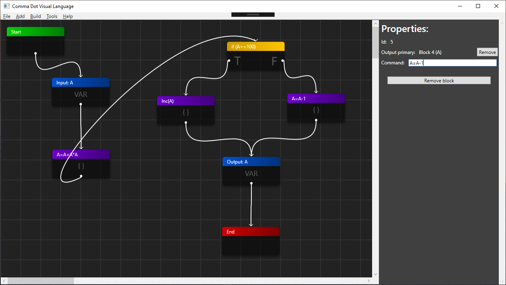

Comma Dot Visual Language
==================================

**Comma Dot Visual Language**  is written in C# using WPF software for visual programming. It uses simple GUI and can calculate mathematical equations. There are 6 type of blocks. This application can be used for new programmers to illustrate algorithms.

## Requirements

* Windows operating system
* Visual Studio 2015 with .Net Framework 4.5.2

## Source code

You can also download latest version of source code using git. To do that enter bellow commands in your terminal:
> git clone https://github.com/bilek993/Comma-Dot-Visual-Language.git

or

> git clone git@github.com:bilek993/Comma-Dot-Visual-Language.git

## License

This application is licensed under [GPL-3.0](LICENSE). More information can be found [here](https://www.gnu.org/licenses/gpl-3.0.en.html).

## Authors

This system was developed by Jakub Biliński and Michał Zawadzki.